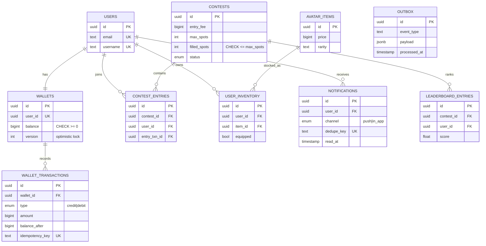
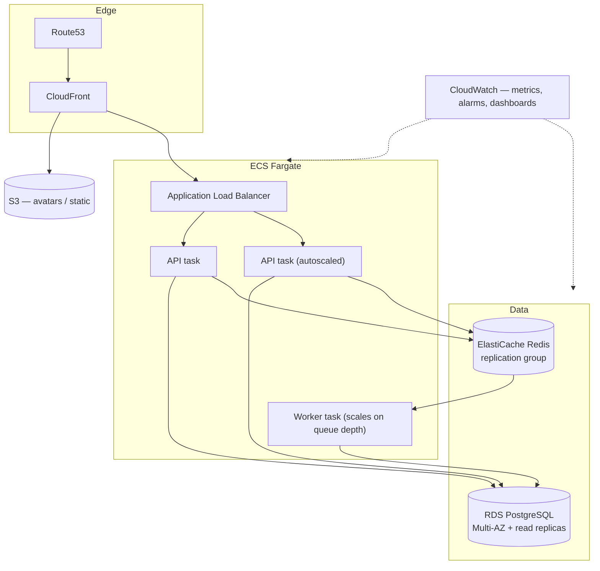
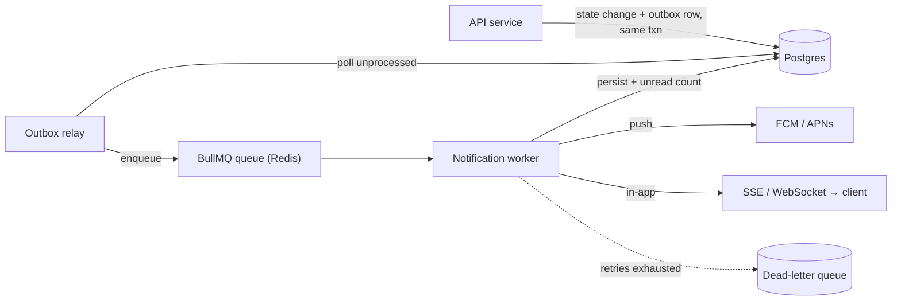

# Fantasy Sports Platform — Backend Architecture

System Architecture

NOTE: the current architecture only contains the folder strucutre and not the code, the db files are developed and placed in the schema.prisma file

A reference backend architecture for a high-concurrency Fantasy Sports platform:
**100,000 registered users, 10,000 concurrent during live events**, with a
transactional wallet, race-free contest joins, real-time leaderboards, and a
resilient notification system.

> This repository is an **architecture scaffold**: the folder structure, a
> complete database schema (`prisma/schema.prisma`), and descriptive stub files
> documenting each component's responsibility and interface. The full design
> rationale lives in
> `[docs/superpowers/specs/2026-06-24-fantasy-sports-backend-design.md](docs/superpowers/specs/2026-06-24-fantasy-sports-backend-design.md)`.

**Stack:** Node.js + TypeScript · Express · Prisma (PostgreSQL) · Redis (ioredis + BullMQ).

---

## 1. System Architecture

A **modular monolith** (one stateless API service with clean internal module
boundaries) plus a **separate async worker** for notifications and score
ingestion. This keeps a wallet deduction and a contest join inside a single ACID
transaction (no distributed-transaction complexity) while still giving the
queue-driven, independently-scalable flow the platform needs. Each module has an
explicit service interface, so any of them can be extracted into its own service
later

### Scaling strategy (summary)

- **API tier** is stateless → scale horizontally behind the ALB on CPU + request
  count.
- **Reads** that dominate at live-event time (leaderboards) are served from Redis,
  never Postgres.
- **Writes** stay short (the outbox keeps side-effects out of the write
  transaction) and are pooled via PgBouncer.
- **Worker tier** scales independently on queue depth.

### Failure handling (summary)

| Failure               | Mitigation                                                                  |
| --------------------- | --------------------------------------------------------------------------- |
| API task dies         | Stateless; ALB reroutes; ECS replaces the task                              |
| Postgres primary down | RDS Multi-AZ auto-failover; idempotent retries make in-flight requests safe |
| Redis down            | Replica promotion; leaderboard rebuildable from Postgres                    |
| Push provider down    | Circuit breaker + retry with backoff                                        |
| Event publish loss    | Transactional **outbox** — event committed with the state change            |
| Poison job            | Capped retries → **dead-letter queue**                                      |

---

## 2. Database Schema

Full schema in `[prisma/schema.prisma](prisma/schema.prisma)`. Money is stored as
integer **minor units in `BIGINT`** (never floats). The `wallet_transactions`
ledger is **append-only**.



### Indexing & integrity highlights

- **UNIQUE** `wallet_transactions.idempotency_key` — retries cannot double-charge.
- **UNIQUE** `contest_entries (contest_id, user_id)` — cannot join twice.
- `CHECK (filled_spots <= max_spots)` and `CHECK (balance >= 0)` as hard backstops.
- `wallet_transactions (wallet_id, created_at DESC)` for history pagination.
- `contests (status, start_time)` for lobby listing.
- **Partial** indexes (added via manual migration): `notifications (user_id) WHERE read_at IS NULL`, `outbox (created_at) WHERE processed_at IS NULL`.
- **High-write optimizations:** append-only ledger, time-based partitioning of
  `wallet_transactions`, BRIN index on `created_at` for very large tables, short
  transactions via the outbox, PgBouncer connection pooling.

---

## 3. Core Logic (how integrity is enforced)

| Guarantee                 | Mechanism                                                                                                                                                                                          | Where                                            |
| ------------------------- | -------------------------------------------------------------------------------------------------------------------------------------------------------------------------------------------------- | ------------------------------------------------ |
| **No double-spend**       | Atomic `UPDATE wallets SET balance = balance - :amt WHERE id = :id AND balance >= :amt` (precondition in the WHERE clause) + UNIQUE idempotency key + immutable ledger row, all in one transaction | `src/modules/wallet/wallet.service.ts`           |
| **Contest capacity race** | Atomic `UPDATE contests SET filled_spots = filled_spots + 1 WHERE filled_spots < max_spots` (0 rows = full)                                                                                        | `src/modules/contest/contest.service.ts`         |
| **No double-join**        | UNIQUE `(contest_id, user_id)`                                                                                                                                                                     | schema + contest service                         |
| **Atomic join**           | Capacity claim + fee deduct + entry insert in **one** transaction; any failure rolls back all three                                                                                                | contest service                                  |
| **Real-time leaderboard** | Redis sorted set, `ZADD` on score change, `ZREVRANGE` rank-based pagination, `ZREVRANK` for own rank; Postgres rebuild on cache miss                                                               | `src/modules/leaderboard/leaderboard.service.ts` |

---

## 4. AWS Infrastructure



- **Auto Scaling:** ECS Service Auto Scaling, target-tracking on CPU **and** ALB
  `RequestCountPerTarget`; worker scales on queue depth.
- **Monitoring:** CloudWatch metrics/alarms (p99 latency, 5xx rate, RDS
  CPU/connections/replica lag, Redis evictions, queue depth, DLQ size),
  dashboards, structured logs, X-Ray tracing.
- **DR / backup:** automated RDS snapshots + point-in-time recovery (WAL),
  cross-region snapshot copy, Multi-AZ for HA. **RTO ≈ minutes, RPO ≈ seconds.**
  Redis is a serving layer (rebuildable from Postgres), not DR-critical.

---

## 5. Real-Time Notification System



- **Reliable emission:** the event row is committed in the **same transaction** as
  the state change (transactional outbox) → no lost events.
- **Processing:** BullMQ worker consumes jobs, fans out to push + in-app, persists
  a `notifications` row, updates the unread count.
- **Retry:** exponential backoff, capped attempts; on exhaustion the job lands in a
  **DLQ** for inspection/replay. Circuit breaker around external push providers.
- **Idempotent delivery:** a per-notification `dedupe_key` prevents duplicate sends
  on retry.

---

## 6. Project Structure

```
.
├── docker-compose.yml          # Postgres (:5433) + Redis (:6380)
├── package.json / tsconfig.json
├── .env.example
├── prisma/
│   ├── schema.prisma           # complete DB schema (9 tables + outbox)
│   └── seed.ts                 # sample users, wallets, contest, items
├── src/
│   ├── config/                 # env, prisma client, redis client
│   ├── shared/                 # error types
│   ├── middleware/             # error handler, zod validation
│   ├── modules/
│   │   ├── wallet/             # service (addFunds/deduct/history) + routes
│   │   ├── contest/            # join logic + routes
│   │   ├── leaderboard/        # Redis ZSET service + routes
│   │   └── notification/       # service + BullMQ worker + outbox relay
│   ├── app.ts                  # Express app factory
│   ├── server.ts               # API entrypoint (stateless, scaled)
│   └── worker.ts               # worker entrypoint (queue + relay)
├── tests/                      # planned test suite (see tests/README.md)
└── docs/superpowers/
    ├── specs/                  # design spec
    └── plans/                  # implementation plan
```

> Source files under `src/` are **documented stubs** describing each component's
> responsibility and planned interface — this repo communicates the architecture,
> not a running build.

---

## 7. HTTP API (planned)

| Method | Path                                    | Purpose                             |
| ------ | --------------------------------------- | ----------------------------------- |
| POST   | `/wallets/:userId/add-funds`            | Credit a wallet (idempotent)        |
| POST   | `/wallets/:userId/deduct`               | Debit a wallet (atomic, idempotent) |
| GET    | `/wallets/:userId/history`              | Paginated transaction ledger        |
| POST   | `/contests/:contestId/join`             | Join a contest (race-free)          |
| GET    | `/contests/:contestId`                  | Contest detail                      |
| POST   | `/leaderboards/:contestId/scores`       | Submit/update a score               |
| GET    | `/leaderboards/:contestId`              | Ranked, paginated leaderboard       |
| GET    | `/leaderboards/:contestId/rank/:userId` | A user's own rank                   |
| GET    | `/health`                               | Liveness probe                      |

---

## 9. How it would run (once implemented)

```bash
docker compose up -d        # Postgres :5433, Redis :6380
npm install
npm run prisma:migrate      # apply schema
npm run seed                # optional sample data
npm run dev                 # API on :3000
npm run worker              # notification worker + outbox relay (separate process)
```
