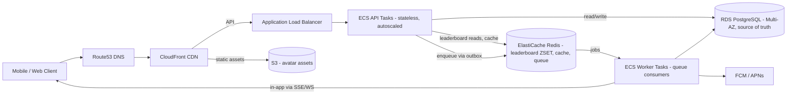
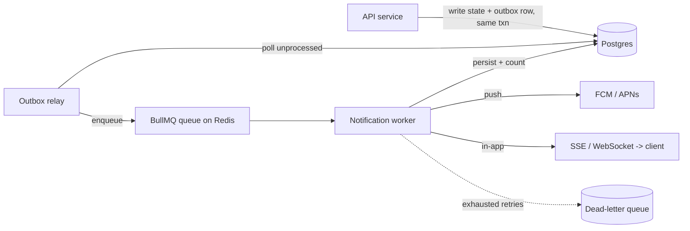

# Fantasy Sports Platform — Backend Architecture Design

**Date:** 2026-06-24
**Status:** Approved
**Author:** Backend engineering (take-home deliverable)

## 1. Overview & Goals

Architect a Fantasy Sports platform backend that maintains **data integrity** and
**performance under high load**.

**Scale targets**
- 100,000 registered users
- 10,000 concurrent users during live events
- Future path to 1,000,000 users

**Core capabilities**
- Real-time leaderboards
- Transactional wallet system (must never double-spend)
- Contest management (join with entry fee, capacity limits)
- Notification services (push + in-app)

**Two concrete deliverables**
1. This design document (architecture, schema, scaling analysis).
2. A runnable TypeScript reference project demonstrating the core logic
   (Wallet, Contest Join, Leaderboard) plus a notification worker.

## 2. Architectural Approach

### Decision: Modular monolith + separate async worker

We deploy **one stateless API service** with clean internal module boundaries
(`wallet`, `contest`, `leaderboard`, `notification`) plus a **separate worker
process** that consumes a queue for notifications and score ingestion.

**Why not full microservices (at this scale):** A wallet deduction and a contest
join must be atomic together. Splitting them across services forces distributed
transactions (sagas, compensating actions) — significant complexity for no benefit
at 10k concurrent users. A modular monolith keeps that operation in a single ACID
database transaction.

**Why a separate worker:** Notification fan-out and score recomputation are bursty
and have a different resource profile than request handling. Isolating them keeps
API latency predictable and lets the two scale independently.

**Seam for the future:** Module boundaries are explicit (each module exposes a
service interface, not its internals), so any module can be extracted into its own
service later. The 1M-user plan (§6) documents that split path.

### Request / data flow



### Failure handling

| Failure | Mitigation |
|---|---|
| API task dies | Stateless tasks; ALB health checks reroute; ECS replaces task |
| Postgres primary down | RDS Multi-AZ automatic failover (~60–120s); idempotent retries make in-flight requests safe |
| Redis down | Replica promotion; leaderboard rebuildable from Postgres source of truth |
| Push provider down | Circuit breaker + retry with backoff; job returns to queue |
| Event publish failure | Outbox pattern — event row committed in same txn as the state change, relay retries |
| Poison job | Capped retries → dead-letter queue (DLQ) for inspection |

## 3. Database Schema (PostgreSQL)

Nine tables. Money is stored in the **smallest currency unit as `BIGINT`** (e.g.
paise/cents) — never floats.

### Tables

- **users** — `id (uuid pk)`, `email (unique)`, `username (unique)`,
  `password_hash`, `created_at`, `updated_at`.
- **wallets** — `id (uuid pk)`, `user_id (uuid, unique, fk → users)`,
  `balance (bigint, CHECK >= 0)`, `currency`, `version (int, optimistic lock)`,
  `updated_at`. 1:1 with users.
- **wallet_transactions** — append-only double-entry ledger.
  `id (uuid pk)`, `wallet_id (fk)`, `type (enum: credit|debit)`,
  `amount (bigint, CHECK > 0)`, `balance_after (bigint)`,
  `reference_type (enum: deposit|withdrawal|contest_entry|payout|refund)`,
  `reference_id (uuid, nullable)`, `idempotency_key (text, UNIQUE)`, `created_at`.
  **Never updated or deleted.**
- **contests** — `id (uuid pk)`, `name`, `entry_fee (bigint)`,
  `max_spots (int)`, `filled_spots (int, default 0, CHECK filled_spots <= max_spots)`,
  `prize_pool (bigint)`, `status (enum: upcoming|live|completed|cancelled)`,
  `start_time`, `end_time`, `created_at`.
- **contest_entries** — `id (uuid pk)`, `contest_id (fk)`, `user_id (fk)`,
  `entry_txn_id (fk → wallet_transactions)`, `joined_at`.
  **UNIQUE (contest_id, user_id)**.
- **leaderboard_entries** — Postgres source of truth for scores.
  `id (uuid pk)`, `contest_id (fk)`, `user_id (fk)`, `score (numeric)`,
  `rank (int, nullable)`, `updated_at`. **UNIQUE (contest_id, user_id)**.
  The Redis ZSET is the hot serving layer, rebuildable from this table.
- **avatar_items** — catalog. `id (uuid pk)`, `name`, `category`,
  `price (bigint)`, `rarity`, `asset_url`, `is_active`.
- **user_inventory** — `id (uuid pk)`, `user_id (fk)`, `item_id (fk)`,
  `acquired_at`, `equipped (bool)`. **UNIQUE (user_id, item_id)**.
- **notifications** — `id (uuid pk)`, `user_id (fk)`, `type`, `title`, `body`,
  `data (jsonb)`, `channel (enum: push|in_app)`, `read_at (nullable)`,
  `created_at`.
- **outbox** — reliable event emission. `id (uuid pk)`, `aggregate_type`,
  `aggregate_id`, `event_type`, `payload (jsonb)`, `created_at`,
  `processed_at (nullable)`.

### Indexing strategy

| Index | Purpose |
|---|---|
| `wallets (user_id)` UNIQUE | 1:1 lookup |
| `wallet_transactions (wallet_id, created_at DESC)` | history pagination |
| `wallet_transactions (idempotency_key)` UNIQUE | dedupe retries |
| `contest_entries (contest_id, user_id)` UNIQUE | prevent double-join |
| `contest_entries (user_id)` | "my contests" listing |
| `contests (status, start_time)` | lobby listing |
| `leaderboard_entries (contest_id, user_id)` UNIQUE | upsert score |
| `notifications (user_id) WHERE read_at IS NULL` PARTIAL | unread badge/count |
| `outbox (processed_at) WHERE processed_at IS NULL` PARTIAL | relay polling |

### High-write optimizations

- **Append-only ledger** — `wallet_transactions` is insert-only; no row contention
  from updates, no vacuum churn from dead tuples on hot rows.
- **Time partitioning** — partition `wallet_transactions` by month; old partitions
  detach cheaply for archival.
- **BRIN index on `created_at`** for very large append-only tables (cheap, tiny).
- **Short transactions** — outbox keeps side-effects out of the write txn, so locks
  are held for microseconds.
- **Connection pooling** — PgBouncer (transaction mode) in front of RDS to survive
  thousands of short-lived app connections.

## 4. Backend Core Logic

### 4.1 Wallet Service — atomicity & no double-spend

Three operations: `addFunds`, `deduct`, `history`.

**The deduct guarantee** rests on three mechanisms working together:

1. **Atomic conditional update** — the balance change and its precondition are a
   single statement, so there is no read-then-write race:
   ```sql
   UPDATE wallets
   SET balance = balance - :amount, version = version + 1, updated_at = now()
   WHERE id = :walletId AND balance >= :amount;
   ```
   `rowsAffected = 0` means insufficient funds (or wallet gone) → reject. The row
   lock the `UPDATE` takes serializes concurrent deducts on the same wallet.

2. **Idempotency key** — every mutation carries a client-supplied
   `idempotency_key` with a UNIQUE constraint on the ledger. A retried request
   collides on insert and we return the original result instead of charging twice.

3. **Immutable ledger** — the matching `wallet_transactions` row is inserted in the
   **same transaction** as the balance update. Balance is always reconcilable by
   replaying the ledger.

All wrapped in a Prisma interactive transaction (`prisma.$transaction(async tx =>
{...})`), using `tx.$executeRaw` for the conditional update.

### 4.2 Contest Join API — capacity + entry fee race

A single DB transaction performs three guarded steps; any failure rolls back all:

1. **Atomic capacity claim:**
   ```sql
   UPDATE contests SET filled_spots = filled_spots + 1
   WHERE id = :contestId AND status = 'upcoming' AND filled_spots < max_spots;
   ```
   `rowsAffected = 0` → contest full or not joinable → abort.
2. **Insert entry** with `UNIQUE (contest_id, user_id)` → second concurrent join by
   the same user fails cleanly (already joined).
3. **Deduct entry fee** via the Wallet Service logic (§4.1), linking the resulting
   ledger txn id onto the entry.

This closes both the over-capacity race (step 1) and the double-join race (step 2)
without any application-level locking.

### 4.3 Leaderboard API — Redis + efficient pagination

- **Storage:** one Redis Sorted Set per contest, key `lb:{contestId}`,
  member = `userId`, score = points.
- **Write:** `ZADD lb:{contestId} :score :userId` on every score change
  (also upserts `leaderboard_entries` as source of truth). O(log N).
- **Read (page):** rank-based, never `OFFSET`:
  `ZREVRANGE lb:{contestId} :start :stop WITHSCORES` → O(log N + page).
- **Caller's own rank:** `ZREVRANK lb:{contestId} :userId` (+1 for 1-based).
- **Cache miss / cold key:** rebuild the ZSET from `leaderboard_entries` with a
  short TTL guard, then serve.

## 5. AWS Infrastructure

```
Route53  -->  CloudFront  -->  ALB  -->  ECS Fargate (API service + Worker service)
   |              |                          |          |
 health        S3 (avatars,            ElastiCache   RDS PostgreSQL
 failover      static assets)          Redis (repl   (Multi-AZ + read replicas)
                                       group)
```

- **Auto Scaling:** ECS Service Auto Scaling with target-tracking on CPU **and** ALB
  `RequestCountPerTarget`. Scale-out fast, scale-in slow. Worker scales on queue
  depth.
- **Monitoring:** CloudWatch metrics + alarms (p99 latency, 5xx rate, RDS CPU /
  connections / replica lag, Redis evictions, queue depth, DLQ size), dashboards,
  structured JSON logs, X-Ray tracing.
- **DR / backup:** automated RDS snapshots + PITR via WAL (configurable retention),
  cross-region snapshot copy, Multi-AZ for HA. **Documented RTO ≈ minutes
  (failover), RPO ≈ seconds (WAL)**. Redis is a cache/serving layer — recoverable
  from Postgres, so it is not the DR-critical store.

## 6. Performance & Scaling Analysis

**Q1 — 10,000 concurrent leaderboard requests?**
Serve reads entirely from Redis sorted sets (O(log N + page), sub-millisecond), not
Postgres. API tasks are stateless and autoscale behind the ALB on request count.
Redis read replicas absorb read fan-out; short-TTL response caching for identical
top-N pages. Postgres is never on the hot read path.

**Q2 — Scale 100k → 1M users?**
Progressive, in order: (1) vertical scale + more API tasks; (2) RDS read replicas,
route reads off the primary; (3) PgBouncer for connection multiplexing;
(4) **shard wallets & transactions by `user_id`** (hash) once a single primary's
write ceiling is near; (5) Redis Cluster for leaderboard sharding;
(6) extract worker-heavy and read-heavy paths into dedicated services (the
microservice seam) — a CQRS-style read/write split for leaderboards.

**Q3 — Mathematically/technically prevent double wallet deductions?**
Correctness does not depend on application logic ordering. The deduction is a single
atomic SQL statement with the balance check in its `WHERE` clause
(`balance = balance - x WHERE balance >= x`), so two concurrent deductions are
serialized by the row lock and the second sees the already-reduced balance. Layered
on top: a `UNIQUE` idempotency key makes retries no-ops, a `CHECK (balance >= 0)` is
a hard backstop, and the append-only ledger lets us prove the balance by replay.

**Q4 — Recovery if the database crashes mid-contest?**
RDS Multi-AZ fails over to the standby automatically (~60–120s). Because every
wallet/contest mutation is idempotent (idempotency keys) and wrapped in a single
transaction, any request in flight at crash time either fully committed or fully
rolled back — clients safely retry. Leaderboards keep serving from Redis during
failover. After recovery, the outbox relay resumes and PITR covers any
point-in-time restore need. No partial deductions, no lost entries.

## 7. Bonus — Real-Time Notification System



- **Reliable emission:** outbox row committed in the same transaction as the state
  change → no lost events even if Redis is briefly down.
- **Queue processing:** BullMQ (Redis-backed) worker consumes jobs, fans out to push
  and in-app channels, persists a `notifications` row, updates unread count.
- **Retry:** exponential backoff with capped attempts; on exhaustion the job moves to
  a **DLQ** for inspection/replay. Circuit breaker around external push providers.
- **Idempotent delivery:** per-notification dedup key prevents duplicate sends on
  retry.

## 8. Reference Project Layout

TypeScript + Express + Prisma + ioredis + BullMQ, fully runnable.

```
fantasy-sports-backend/
  docker-compose.yml        # postgres + redis
  package.json / tsconfig.json
  prisma/
    schema.prisma           # all 9 tables + outbox
    migrations/
    seed.ts                 # users, wallets, a contest, avatar items
  src/
    config/                 # env, db, redis clients
    modules/
      wallet/               # service (addFunds/deduct/history) + routes
      contest/              # join logic + routes
      leaderboard/          # Redis ZSET service + routes
      notification/         # outbox relay + BullMQ worker + SSE
    middleware/             # validation (zod), error handler, auth stub
    app.ts / server.ts / worker.ts
  tests/                    # wallet concurrency, contest capacity race, leaderboard
  README.md                 # run instructions + how each guarantee is enforced
```

**Test focus (proving the guarantees):**
- Wallet: concurrent deduct never goes negative; idempotency-key retry charges once.
- Contest: N concurrent joins on a contest with M < N spots fill exactly M; no double
  join.
- Leaderboard: ZSET ranking + pagination correctness.

## 9. Non-Goals (YAGNI)

- Full authentication/authorization system (a simple stub/JWT placeholder only).
- Real payment-gateway integration (wallet top-up is mocked).
- Real sports data feed (score ingestion is simulated/seeded).
- Admin dashboards, KYC, fraud detection, multi-currency FX.
- Terraform/CDK infra-as-code (AWS design is documented, not codified).
